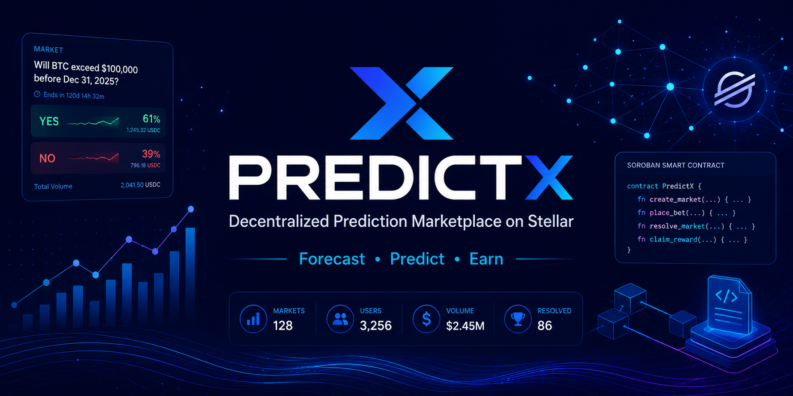

<p align="center">
  
</p>

# PredictX

**Decentralized Prediction Marketplace on Stellar**

PredictX is an open-source prediction marketplace built on the Stellar network using Soroban smart contracts. It enables users to create markets, forecast outcomes, stake digital assets, and receive automated rewards through transparent on-chain settlement.

From sports and technology to economics and community-driven questions, PredictX transforms collective forecasting into a decentralized, trustless experience powered by Stellar.

## Why PredictX?

Traditional prediction platforms rely on centralized operators to hold funds, manage markets, and distribute winnings. PredictX removes these intermediaries by leveraging Soroban smart contracts for secure fund custody, transparent market resolution, and automated reward distribution.

## Features

* Create prediction markets
* Forecast real-world outcomes
* Stake XLM and Stellar-based assets
* Automated on-chain reward distribution
* Transparent market history
* Freighter wallet integration
* Built with Soroban smart contracts
* Open-source and community-driven

## Technology Stack

### Smart Contracts

* Rust
* Soroban SDK

### Frontend

* Next.js
* TypeScript
* Tailwind CSS

### Wallets

* Freighter
* Stellar Wallet Kit

### Blockchain

* Stellar Network
* Soroban Smart Contracts

## Repository Structure

```text
contracts/      Soroban smart contracts
frontend/       Next.js frontend application
docs/           Technical documentation
scripts/        Deployment and automation scripts
tests/          Integration and testing suites
.github/        Workflows and project templates
```

## Project Status

🚧 MVP Development

Current development focuses on:

* Market creation
* Betting engine
* Market resolution
* Reward distribution
* Wallet integration
* Testnet deployment

## Roadmap

### Phase 1

* Core smart contracts
* Market creation
* Betting logic

### Phase 2

* Wallet integration
* Frontend marketplace

### Phase 3

* Reward settlement
* Analytics dashboard

### Phase 4

* Decentralized market resolution
* Oracle integrations

## Contributing

Contributions are welcome.

Please review the CONTRIBUTING.md guidelines before opening issues or pull requests.

## License

MIT License
